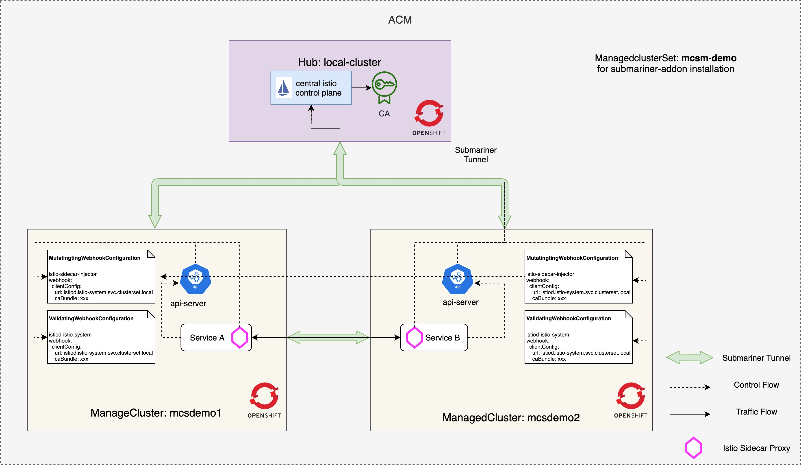
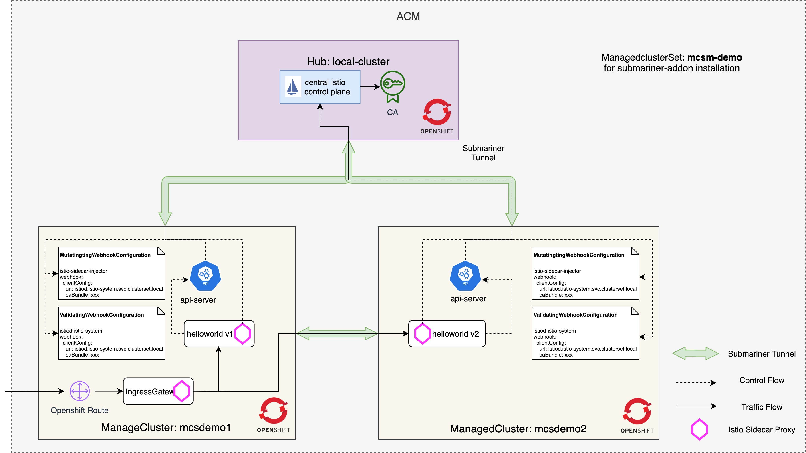
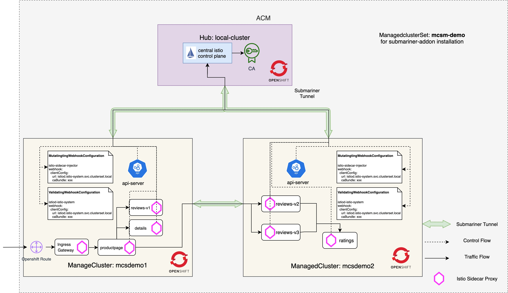

## Architecture



## Environment Information

- ACM Version: 2.3.3-SNAPSHOT-2021-09-14-13-54-55
- Submariner Version: v0.9.0
- Istio version: 1.11.3

## Prerequisites

1. Prepare three openshift clusters that satisfy the [submariner deploying requirements](https://access.redhat.com/documentation/en-us/red_hat_advanced_cluster_management_for_kubernetes/2.3/html/services/services-overview#submariner-prereq)
2. Install ACM hub to one of the three clusters and import the other clusters as managed clusters.
3. Deploy the submariner by following the [steps](https://access.redhat.com/documentation/en-us/red_hat_advanced_cluster_management_for_kubernetes/2.3/html/services/services-overview#deploying-submariner-console) to make the three clusters are directly connected.
4. Download and extra istio release package in current working directory, `istio-1.11.3` is used for this demo.
4. Follow these [instructions](https://istio.io/latest/docs/setup/platform-setup/openshift/) to update security configurations for the three openshift clusters before deploying istio.

## Prepare for the Istio Multicluster Service Mesh

1. Login the three openshift clusters:

```
$ oc config get-contexts
CURRENT   NAME                                                              CLUSTER                                        AUTHINFO                                                  NAMESPACE
          default/api-mcsdemo-dev05-red-chesterfield-com:6443/kube:admin    api-mcsdemo-dev05-red-chesterfield-com:6443    kube:admin/api-mcsdemo-dev05-red-chesterfield-com:6443    default
          default/api-mcsdemo1-dev05-red-chesterfield-com:6443/kube:admin   api-mcsdemo1-dev05-red-chesterfield-com:6443   kube:admin/api-mcsdemo1-dev05-red-chesterfield-com:6443   default
*         default/api-mcsdemo2-dev05-red-chesterfield-com:6443/kube:admin   api-mcsdemo2-dev05-red-chesterfield-com:6443   kube:admin/api-mcsdemo2-dev05-red-chesterfield-com:6443   default
```

2. Export the the following environment variables will be used throughout to simplify the instructions:

```
export CTX_HUB_CLUSTER=<context of the hub cluster>
export CTX_MC1_CLUSTER=<context of the managed cluster: mcsdemo1>
export CTX_MC2_CLUSTER=<context of the managed cluster: mcsdemo2>
export CENTRAL_ISTIOD_ADDR=<FQDN of the central istiod that can be accessed among the three clusters>
export MC1_CLUSTER_NAME=<name of the managedcluster 1: mcsdemo1>
export MC2_CLUSTER_NAME=<name of the managedcluster 2: mcsdemo2>
```

For this demo environment, the environment variables are as follow:

```
export CTX_HUB_CLUSTER=default/api-mcsdemo-dev05-red-chesterfield-com:6443/kube:admin
export CTX_MC1_CLUSTER=default/api-mcsdemo1-dev05-red-chesterfield-com:6443/kube:admin
export CTX_MC2_CLUSTER=default/api-mcsdemo2-dev05-red-chesterfield-com:6443/kube:admin
export CENTRAL_ISTIOD_ADDR=istiod.istio-system.svc.clusterset.local
export MC1_CLUSTER_NAME=mcsdemo1
export MC2_CLUSTER_NAME=mcsdemo2
```

## Set up the Istio Installation on Managed Clusters

1. Use the `external` profile to configure the remote cluster’s(managedclusters) Istio installation. This installs an injection webhook that uses the central control plane’s injector, instead of a locally deployed one:

```
cat <<EOF > istio-remote-config-${MC1_CLUSTER_NAME}.yaml
apiVersion: install.istio.io/v1alpha1
kind: IstioOperator
metadata:
  namespace: istio-system
spec:
  profile: external
  components:
    base:
      enabled: true
    cni:
      enabled: true
      namespace: kube-system
      k8s:
        overlays:
          - kind: DaemonSet
            name: istio-cni-node
            patches:
              - path: spec.template.spec.containers[0].securityContext.privileged
                value: true
  values:
    global:
      configCluster: true
      meshID: mesh1
      multiCluster:
        clusterName: ${MC1_CLUSTER_NAME}
      network: network1
    pilot:
      configMap: true
    istiodRemote:
      injectionURL: https://${CENTRAL_ISTIOD_ADDR}:443/inject/:ENV:cluster=${MC1_CLUSTER_NAME}:ENV:net=network1
    base:
      validationURL: https://${CENTRAL_ISTIOD_ADDR}:443/validate
    cni:
      cniBinDir: /var/lib/cni/bin
      cniConfDir: /etc/cni/multus/net.d
      chained: false
      cniConfFileName: "istio-cni.conf"
      excludeNamespaces:
       - istio-system
       - kube-system
      logLevel: info
    sidecarInjectorWebhook:
      injectedAnnotations:
        k8s.v1.cni.cncf.io/networks: istio-cni
EOF
```

2. Then install the istio configurations on the remote clusters:

```
oc --context=${CTX_MC1_CLUSTER} create namespace istio-system
istioctl manifest generate -f istio-remote-config-${MC1_CLUSTER_NAME}.yaml | oc apply --context=${CTX_MC1_CLUSTER} -f -
```

3. Replace the `${MC1_CLUSTER_NAME}` and `${CTX_MC1_CLUSTER}` with `${MC2_CLUSTER_NAME}` and `${CTX_MC2_CLUSTER}` and repleat step 1 and 2.

```
cat <<EOF > istio-remote-config-${MC2_CLUSTER_NAME}.yaml
apiVersion: install.istio.io/v1alpha1
kind: IstioOperator
metadata:
  namespace: istio-system
spec:
  profile: external
  components:
    base:
      enabled: true
    cni:
      enabled: true
      namespace: kube-system
      k8s:
        overlays:
          - kind: DaemonSet
            name: istio-cni-node
            patches:
              - path: spec.template.spec.containers[0].securityContext.privileged
                value: true
  values:
    global:
      configCluster: true
      meshID: mesh1
      multiCluster:
        clusterName: ${MC2_CLUSTER_NAME}
      network: network1
    pilot:
      configMap: true
    istiodRemote:
      injectionURL: https://${CENTRAL_ISTIOD_ADDR}:443/inject/:ENV:cluster=${MC2_CLUSTER_NAME}:ENV:net=network1
    base:
      validationURL: https://${CENTRAL_ISTIOD_ADDR}:443/validate
    cni:
      cniBinDir: /var/lib/cni/bin
      cniConfDir: /etc/cni/multus/net.d
      chained: false
      cniConfFileName: "istio-cni.conf"
      excludeNamespaces:
       - istio-system
       - kube-system
      logLevel: info
    sidecarInjectorWebhook:
      injectedAnnotations:
        k8s.v1.cni.cncf.io/networks: istio-cni
EOF
```

```
oc --context=${CTX_MC2_CLUSTER} create namespace istio-system
istioctl manifest generate -f istio-remote-config-${MC2_CLUSTER_NAME}.yaml | oc --context=${CTX_MC2_CLUSTER} apply -f -
```

4. Verify the Istio resources are created in remote clusters:

```
oc --context=${CTX_MC1_CLUSTER} -n istio-system get sa,secret,cm
oc --context=${CTX_MC2_CLUSTER} -n istio-system get sa,secret,cm
oc --context=${CTX_MC1_CLUSTER} get mutatingwebhookconfiguration istio-sidecar-injector
oc --context=${CTX_MC1_CLUSTER} get validatingwebhookconfiguration istio-validator-istio-system
```

## Set up the Central Istio Control Plane on Hub Cluster

1. Create the `istio-system` namespace in the hub cluster, which will be used to host the central control plane:

```
oc --context=${CTX_HUB_CLUSTER} create ns istio-system
```

2. The control plane in the hub cluster needs access to the managed clusters to discover services, endpoints, and pod attributes. Create a secret with credentials to access the managed cluster’s kube-apiserver and install it in the hub cluster:

```
oc --context=${CTX_HUB_CLUSTER} -n istio-system create serviceaccount istiod-service-account
```

```
ISTIO_READER_SRT_NAME_FOR_MC1=$(oc --context=${CTX_MC1_CLUSTER} -n istio-system get serviceaccount/istiod -o jsonpath='{.secrets}' | jq -r '.[] | select(.name | test ("istiod-token-")).name')
istioctl x create-remote-secret --context=${CTX_MC1_CLUSTER} --name=${MC1_CLUSTER_NAME} --type=remote \
    --namespace=istio-system --service-account=istiod --secret-name=${ISTIO_READER_SRT_NAME_FOR_MC1} \
    --create-service-account=false | oc --context=${CTX_HUB_CLUSTER} apply -f -
```

```
ISTIO_READER_SRT_NAME_FOR_MC2=$(oc --context=${CTX_MC2_CLUSTER} -n istio-system get serviceaccount/istiod -o jsonpath='{.secrets}' | jq -r '.[] | select(.name | test ("istiod-token-")).name')
istioctl x create-remote-secret --context=${CTX_MC2_CLUSTER} --name=${MC2_CLUSTER_NAME} --type=remote \
    --namespace=istio-system --service-account=istiod --secret-name=${ISTIO_READER_SRT_NAME_FOR_MC2} \
    --create-service-account=false | oc --context=${CTX_HUB_CLUSTER} apply -f -
```

3. Verify the remote secrets are created successfully in the hub cluster:

```
oc --context=${CTX_HUB_CLUSTER} -n istio-system get secret -l istio/multiCluster=true
```

4. Create the Istio configuration to install the central control plane in the `istio-system` namespace of the hub cluster:

```
cat <<EOF > istio-central-config-hub.yaml
apiVersion: install.istio.io/v1alpha1
kind: IstioOperator
metadata:
  namespace: istio-system
spec:
  profile: empty
  meshConfig:
    defaultConfig:
      discoveryAddress: ${CENTRAL_ISTIOD_ADDR}:15012
      proxyMetadata:
        XDS_ROOT_CA: /var/run/secrets/istio/root-cert.pem
        CA_ROOT_CA: /var/run/secrets/istio/root-cert.pem
  components:
    base:
      enabled: true
    cni:
      enabled: true
      namespace: kube-system
      k8s:
        overlays:
          - kind: DaemonSet
            name: istio-cni-node
            patches:
              - path: spec.template.spec.containers[0].securityContext.privileged
                value: true
    pilot:
      enabled: true
      k8s:
        overlays:
        - kind: Deployment
          name: istiod
          patches:
          - path: spec.template.spec.volumes[100]
            value: |-
              name: config-volume
              configMap:
                name: istio
          - path: spec.template.spec.volumes[100]
            value: |-
              name: inject-volume
              configMap:
                name: istio-sidecar-injector
          - path: spec.template.spec.containers[0].volumeMounts[100]
            value: |-
              name: config-volume
              mountPath: /etc/istio/config
          - path: spec.template.spec.containers[0].volumeMounts[100]
            value: |-
              name: inject-volume
              mountPath: /var/lib/istio/inject
        env:
        - name: EXTERNAL_ISTIOD
          value: "true"
        - name: SHARED_MESH_CONFIG
          value: istio
        - name: ISTIOD_CUSTOM_HOST
          value: ${CENTRAL_ISTIOD_ADDR}
  values:
    global:
      caAddress: ${CENTRAL_ISTIOD_ADDR}:15012
      operatorManageWebhooks: true
      meshID: mesh1
      multiCluster:
        clusterName: mcscluster1
      network: network1
    cni:
      cniBinDir: /var/lib/cni/bin
      cniConfDir: /etc/cni/multus/net.d
      chained: false
      cniConfFileName: "istio-cni.conf"
      excludeNamespaces:
       - istio-system
       - kube-system
      logLevel: info
    sidecarInjectorWebhook:
      injectedAnnotations:
        k8s.v1.cni.cncf.io/networks: istio-cni
EOF
```

5. Then apply the Istio configuration on the hub cluster:

```
istioctl --context=${CTX_HUB_CLUSTER} install -f istio-central-config-hub.yaml --skip-confirmation
```

6. Confirm that the central istiod has been successfully deployed:

```
oc --context=${CTX_HUB_CLUSTER} -n istio-system get pod,svc
```

7. Export the central istio control plane with `ServiceExport` so that other managed clusters can access it by the value of `CENTRAL_ISTIOD_ADDR`:

```
cat << EOF | oc --context=${CTX_HUB_CLUSTER} apply -n istio-system -f -
apiVersion: multicluster.x-k8s.io/v1alpha1
kind: ServiceExport
metadata:
  name: istiod
  namespace: istio-system
EOF
```

## Patch the DNS Configuration for the kube-apiserver of Managed Clusters

Due to a submariner [known issue](https://github.com/submariner-io/submariner/issues/1421), the kube-apiserver of Managed Clusters need to be patch to add DNS entry so that the istio webhooks can be working.

1. Get the clusterIP of the central istio control plane in the hub cluster
```
export CENTRAL_ISTIOD_CLUSTER_IP=$(oc --context=${CTX_HUB_CLUSTER} -n istio-system get svc istiod -o jsonpath="{.spec.clusterIP}")
echo ${CENTRAL_ISTIOD_CLUSTER_IP}
```

2. Get all the kube-apiserver pods of managed clusters and patch the `/etc/hosts` to add the new DNS entry of `CENTRAL_ISTIOD_ADDR`, for example:
```
$ oc --context=${CTX_MC1_CLUSTER} -n openshift-kube-apiserver get pod -l apiserver=true
NAME                                          READY   STATUS    RESTARTS   AGE
kube-apiserver-ip-10-0-131-252.ec2.internal   5/5     Running   0          27h
kube-apiserver-ip-10-0-157-108.ec2.internal   5/5     Running   0          27h
kube-apiserver-ip-10-0-174-13.ec2.internal    5/5     Running   0          27h
$ oc --context=${CTX_MC1_CLUSTER} -n openshift-kube-apiserver exec -it kube-apiserver-ip-10-0-131-252.ec2.internal -- vi /etc/hosts
$ oc --context=${CTX_MC1_CLUSTER} -n openshift-kube-apiserver exec -it kube-apiserver-ip-10-0-131-252.ec2.internal -- cat /etc/hosts
127.0.0.1   localhost localhost.localdomain localhost4 localhost4.localdomain4
::1         localhost localhost.localdomain localhost6 localhost6.localdomain6
172.31.197.220 image-registry.openshift-image-registry.svc image-registry.openshift-image-registry.svc.cluster.local # openshift-generated-node-resolver
172.30.182.132 istiod.istio-system.svc.clusterset.local
```

> Note: The step 2 needs to be executed against each of the two managed clusters.

## Enable the Istio Ingressgateway

Istio gateways(ingressgateway and egressgateway) are now can be treated as part of Istio data plane, so it is recommended to install istio gateways in the application namespace.

1. Create the namespace for the isio application and add istio sidecar injection label. For this dmeo, we will deploy the gateway and application in `istio-apps` namespace of managed clusters:

```
oc --context=${CTX_MC1_CLUSTER} create ns istio-apps
oc --context=${CTX_MC1_CLUSTER} label ns istio-apps istio-injection=enabled
oc --context=${CTX_MC2_CLUSTER} create ns istio-apps
oc --context=${CTX_MC2_CLUSTER} label ns istio-apps istio-injection=enabled
```

2. The Istio sidecar injected into each application pod runs with user ID `1337`, which is not allowed by default in openshift clusters. To allow this user ID to be used, execute the following commands for the istio application namespace:

```
oc --context=${CTX_MC1_CLUSTER} adm policy add-scc-to-group anyuid system:serviceaccounts:istio-apps
oc --context=${CTX_MC2_CLUSTER} adm policy add-scc-to-group anyuid system:serviceaccounts:istio-apps
```

3. CNI on OpenShift is managed by `Multus`, and it requires a `NetworkAttachmentDefinition` to be present in the application namespace in order to invoke the `istio-cni` plugin. Execute the following command:

```
cat <<EOF > istio-cni-NetworkAttachmentDefinition.yaml
apiVersion: "k8s.cni.cncf.io/v1"
kind: NetworkAttachmentDefinition
metadata:
  name: istio-cni
EOF

oc --context=${CTX_MC1_CLUSTER} -n istio-apps apply -f istio-cni-NetworkAttachmentDefinition.yaml
oc --context=${CTX_MC2_CLUSTER} -n istio-apps apply -f istio-cni-NetworkAttachmentDefinition.yaml
```

4. Create an istio ingress gateway configuration:

```
cat << EOF > istio-ingress.yaml
apiVersion: install.istio.io/v1alpha1
kind: IstioOperator
metadata:
  name: istio-ingress
spec:
  profile: empty
  components:
    ingressGateways:
    - name: ingressgateway
      namespace: istio-apps
      enabled: true
      label:
        istio: ingressgateway
  values:
    gateways:
      istio-ingressgateway:
        injectionTemplate: gateway
EOF
```

5. Then install the istio-ingressgateway to the application namespace of the managed cluster 1 `mcsdemo1`:

```
istioctl --context=${CTX_MC1_CLUSTER} install -f istio-ingress.yaml --skip-confirmation
```

6. Confirm that the Istio ingress gateway is running:

```
$ oc --context=${CTX_MC1_CLUSTER} -n istio-apps get pod -l istio=ingressgateway
NAME                                    READY   STATUS    RESTARTS   AGE
istio-ingressgateway-788854c955-9xbkr   1/1     Running   0          48s
```

7. Expose the istio-ingressgateway service with openshift route:

```
oc --context=${CTX_MC1_CLUSTER} -n istio-apps expose svc ingressgateway --port=http2
```

> Note: if we want to enable TLS termination of the istio-ingressgateway, we need to expose target-port of `https`.

## Deploy the Helloworld Application



1. Deploy the helloworld-v1 application in to the `istio-apps` namespace of the managed cluster `mcsdemo1`:

```
oc --context=${CTX_MC1_CLUSTER} apply -f istio-1.11.3/samples/helloworld/helloworld.yaml -l service=helloworld -n istio-apps
oc --context=${CTX_MC1_CLUSTER} apply -f istio-1.11.3/samples/helloworld/helloworld.yaml -l version=v1 -n istio-apps
```

2. Deploy the helloworld-v2 application in to the `istio-apps` namespace of the managed cluster `mcsdemo2`:

```
oc --context=${CTX_MC2_CLUSTER} apply -f istio-1.11.3/samples/helloworld/helloworld.yaml -l service=helloworld -n istio-apps
oc --context=${CTX_MC2_CLUSTER} apply -f istio-1.11.3/samples/helloworld/helloworld.yaml -l version=v2 -n istio-apps
```

3. Verify the application pod is injected with istio sidecar and started successfully:

```
$ oc --context=${CTX_MC1_CLUSTER} -n istio-apps get pod
NAME                             READY   STATUS    RESTARTS   AGE
helloworld-v1-776f57d5f6-fksct   2/2     Running   0          19s
$ oc --context=${CTX_MC2_CLUSTER} -n istio-apps get pod
NAME                            READY   STATUS    RESTARTS   AGE
helloworld-v2-54df5f84b-lggk9   2/2     Running   0          21s
```

4. Expose the `helloworld` application with the istio-ingressgateway:

```
oc --context=${CTX_HUB_CLUSTER} create ns istio-apps
oc --context=${CTX_HUB_CLUSTER} apply -n istio-apps -f istio-1.11.3/samples/helloworld/helloworld-gateway.yaml
```

> Note: The istio resources eg. gateway, virtualservice, destinationrule... need to be created in the cluster of the central control plane.

5. Set the `GATEWAY_URL` environment variable:

```
export GATEWAY_URL=$(oc --context=${CTX_MC1_CLUSTER} -n istio-apps get route ingressgateway -o jsonpath="{.spec.host}")
```

6. Confirm the helloworld application can be accessed through the ingress gateway:

```
$ curl -s "http://${GATEWAY_URL}/hello"
Hello version: v2, instance: helloworld-v2-54df5f84b-lggk9
$ curl -s "http://${GATEWAY_URL}/hello"
Hello version: v1, instance: helloworld-v1-776f57d5f6-fksct
$ curl -s "http://${GATEWAY_URL}/hello"
Hello version: v2, instance: helloworld-v2-54df5f84b-lggk9
$ curl -s "http://${GATEWAY_URL}/hello"
Hello version: v1, instance: helloworld-v1-776f57d5f6-fksct
```

## Deploy the Bookinfo Application



1. Deploy the productpage, details and reviews-v1 microservices into the `istio-apps` namespace of the managed cluster `mcsdemo1`:

```
oc --context=${CTX_MC1_CLUSTER} apply -f istio-1.11.3/samples/bookinfo/platform/kube/bookinfo.yaml -l account=productpage -n istio-apps
oc --context=${CTX_MC1_CLUSTER} apply -f istio-1.11.3/samples/bookinfo/platform/kube/bookinfo.yaml -l service=productpage -n istio-apps
oc --context=${CTX_MC1_CLUSTER} apply -f istio-1.11.3/samples/bookinfo/platform/kube/bookinfo.yaml -l app=productpage,version=v1 -n istio-apps

oc --context=${CTX_MC1_CLUSTER} apply -f istio-1.11.3/samples/bookinfo/platform/kube/bookinfo.yaml -l account=details -n istio-apps
oc --context=${CTX_MC1_CLUSTER} apply -f istio-1.11.3/samples/bookinfo/platform/kube/bookinfo.yaml -l service=details -n istio-apps
oc --context=${CTX_MC1_CLUSTER} apply -f istio-1.11.3/samples/bookinfo/platform/kube/bookinfo.yaml -l app=details,version=v1 -n istio-apps

oc --context=${CTX_MC1_CLUSTER} apply -f istio-1.11.3/samples/bookinfo/platform/kube/bookinfo.yaml -l account=reviews -n istio-apps
oc --context=${CTX_MC1_CLUSTER} apply -f istio-1.11.3/samples/bookinfo/platform/kube/bookinfo.yaml -l service=reviews -n istio-apps
oc --context=${CTX_MC1_CLUSTER} apply -f istio-1.11.3/samples/bookinfo/platform/kube/bookinfo.yaml -l app=reviews,version=v1 -n istio-apps
```

2. Deploy reviews-v2, reviews-v3 and ratings microservices in to the `istio-apps` namespace of the managed cluster `mcsdemo2`:

```
oc --context=${CTX_MC2_CLUSTER} apply -f istio-1.11.3/samples/bookinfo/platform/kube/bookinfo.yaml -l account=reviews -n istio-apps
oc --context=${CTX_MC2_CLUSTER} apply -f istio-1.11.3/samples/bookinfo/platform/kube/bookinfo.yaml -l service=reviews -n istio-apps
oc --context=${CTX_MC2_CLUSTER} apply -f istio-1.11.3/samples/bookinfo/platform/kube/bookinfo.yaml -l app=reviews,version=v2 -n istio-apps
oc --context=${CTX_MC2_CLUSTER} apply -f istio-1.11.3/samples/bookinfo/platform/kube/bookinfo.yaml -l app=reviews,version=v3 -n istio-apps

oc --context=${CTX_MC2_CLUSTER} apply -f istio-1.11.3/samples/bookinfo/platform/kube/bookinfo.yaml -l account=ratings -n istio-apps
oc --context=${CTX_MC2_CLUSTER} apply -f istio-1.11.3/samples/bookinfo/platform/kube/bookinfo.yaml -l service=ratings -n istio-apps
oc --context=${CTX_MC2_CLUSTER} apply -f istio-1.11.3/samples/bookinfo/platform/kube/bookinfo.yaml -l app=ratings,version=v1 -n istio-apps
```

3. Verify the application pods are injected with istio sidecar and started successfully:

```
oc --context=${CTX_MC1_CLUSTER} -n istio-apps get pod
oc --context=${CTX_MC2_CLUSTER} -n istio-apps get pod
```

4. Verify the istio sidecars are connected to the central control plane:

```
$ istioctl --context=${CTX_HUB_CLUSTER} proxy-status
NAME                                           CDS        LDS        EDS        RDS        ISTIOD                      VERSION
details-v1-79f774bdb9-dfmbp.istio-apps         SYNCED     SYNCED     SYNCED     SYNCED     istiod-59886bbff5-pbn5g     1.11.3
helloworld-v1-776f57d5f6-62gzl.istio-apps      SYNCED     SYNCED     SYNCED     SYNCED     istiod-59886bbff5-pbn5g     1.11.3
helloworld-v2-54df5f84b-q5sv6.istio-apps       SYNCED     SYNCED     SYNCED     SYNCED     istiod-59886bbff5-pbn5g     1.11.3
ingressgateway-5867f69d7c-npl2q.istio-apps     SYNCED     SYNCED     SYNCED     SYNCED     istiod-59886bbff5-pbn5g     1.11.3
productpage-v1-6b746f74dc-797dh.istio-apps     SYNCED     SYNCED     SYNCED     SYNCED     istiod-59886bbff5-pbn5g     1.11.3
ratings-v1-b6994bb9-wqkws.istio-apps           SYNCED     SYNCED     SYNCED     SYNCED     istiod-59886bbff5-pbn5g     1.11.3
reviews-v1-545db77b95-mrdqn.istio-apps         SYNCED     SYNCED     SYNCED     SYNCED     istiod-59886bbff5-pbn5g     1.11.3
reviews-v2-7bf8c9648f-qrmzq.istio-apps         SYNCED     SYNCED     SYNCED     SYNCED     istiod-59886bbff5-pbn5g     1.11.3
reviews-v3-84779c7bbc-jrbkp.istio-apps         SYNCED     SYNCED     SYNCED     SYNCED     istiod-59886bbff5-pbn5g     1.11.3
```

5. Expose the `bookinfo` application with the istio-ingressgateway:

```
oc --context=${CTX_HUB_CLUSTER} apply -n istio-apps -f istio-1.11.3/samples/bookinfo/networking/bookinfo-gateway.yaml
```

6. Set the `GATEWAY_URL` environment variable:

```
export GATEWAY_URL=$(oc --context=${CTX_MC1_CLUSTER} -n istio-apps get route ingressgateway -o jsonpath="{.spec.host}")
```

7. To confirm that the bookinfo application is accessible from outside the cluster, run the following curl command:

$ curl -s "http://${GATEWAY_URL}/productpage" | grep -o "<title>.*</title>"
<title>Simple Bookstore App</title>

> Note: We can also point our browser to http://$GATEWAY_URL/productpage to view the Bookinfo web page. If you refresh the page several times, you should see different versions of reviews shown in productpage, presented in a round robin style (red stars, black stars, no stars), since we haven’t yet used Istio to control the version routing.

8. Apply default destination rules for the bookinfo application:

```
oc --context=${CTX_HUB_CLUSTER} apply -n istio-apps -f istio-1.11.3/samples/bookinfo/networking/destination-rule-all.yaml
```

9. To route to one version only, we apply virtual services that set the default version for the microservices. In this case, the virtual services will route all traffic to v1 of each microservice:

```
oc --context=${CTX_HUB_CLUSTER} apply -n istio-apps -f istio-1.11.3/samples/bookinfo/networking/virtual-service-all-v1.yaml
```

10. Test the new configuration once again by refreshing the `/productpage` of the Bookinfo app. Notice that the reviews part of the page displays with no rating stars, no matter how many times we refresh. This is because we configured Istio to route all traffic for the reviews service to the version `reviews:v1` and this version of the service does not access the star ratings service.

11. Next, we will change the route configuration so that all traffic from a specific user is routed to a specific service version. In this case, all traffic from a user named `jason` will be routed to the service `reviews:v2`:

```
oc --context=${CTX_HUB_CLUSTER} apply -n istio-apps -f istio-1.11.3/samples/bookinfo/networking/virtual-service-reviews-test-v2.yaml
```

12. On the `/productpage` of the bookinfo application, log in as user `jason` and refresh the browser many times then we will find the black stars(`reviews:v2`) is always shown. If we login as other users, then the stars are gone, because traffic is routed to `reviews:v1` for all users except `jason`.

13. Now, we want to transfer 50% of the traffic from `reviews:v1` to `reviews:v3`, then we apply following virtual service:

```
oc --context=${CTX_HUB_CLUSTER} apply -n istio-apps -f istio-1.11.3/samples/bookinfo/networking/virtual-service-reviews-50-v3.yaml
```

14. Refresh the `/productpage` in our browser and we now see red colored star ratings approximately 50% of the time. This is because the v3 version of reviews show the red star ratings, but the v1 version does not.

15. If the v3 version reviews are stable, then we can shift all traffic to reviews to v3, to achieve that, we need to apply the following virtual service:

```
oc --context=${CTX_HUB_CLUSTER} apply -n istio-apps -f istio-1.11.3/samples/bookinfo/networking/virtual-service-reviews-v3.yaml
```

16. Refresh the `/productpage` in our browser and we now should always see red colored star ratings. This is because we shift all traffic to the v3 version of reviews.

