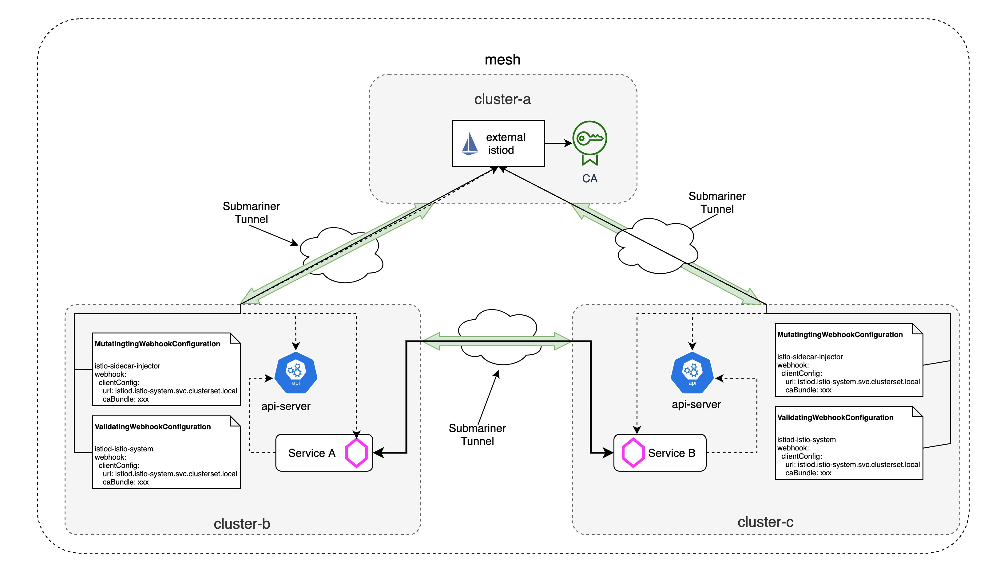

# Set up central Istiod with Submariner

## TL;DR

If you have't read the [last blog](./setup-istio-multicluster-with-submariner.md) about how to set up istio multicluster with submariner, please go through it before starting. In this blog, we will see how to set up a central istiod in one openshift cluster and use it to manage microservices deployed in other openshift clusters.



## Prerequisites

Before we begin the installation, we need to prepare two openshift clusters and deploy submariner for interconnection between the two clusters by following the [steps](https://submariner.io/getting-started/quickstart/openshift/aws/). To make it clear, we will create the following two clusters `mcscluster1` and `mcscluster2` with different IP CIDR ranges:

| Cluster | Pod CIDR | Service CIDR |
| --- | --- | --- |
| mcscluster1 | 10.128.0.0/14 | 172.30.0.0/16 |
| mcscluster2 | 10.132.0.0/14 | 172.31.0.0/16 |

For the submariner installation, we will use `mcscluster1` as the broker and then join `mcscluster1` and `mcscluster2` to the broker. Remember to verify that submariner is working properly by using the `subctl` command:

```bash
export KUBECONFIG=mcscluster1/auth/kubeconfig:mcscluster2/auth/kubeconfig
subctl verify --kubecontexts mcscluster1,mcscluster2 --only service-discovery,connectivity --verbose
```

In addition, we also need to follow these [instructions](https://istio.io/latest/docs/setup/platform-setup/openshift/) to update security configurations for the two openshift clusters before deploying istio.

## Cluster Configuration

### Environment Variables

The following environment variables will be used throughout to simplify the instructions:

| Environment Variable | Description |
| --- | --- |
| CENTRAL_ISTIOD_ADDR | The hostname of the central istio contral plane exported on the central openshift cluster. This is used by the remote clusters to access the central control plane. |
| REMOTE_CLUSTER_NAME | The name of the remote cluster. |

Set the value for the environment variavbles `CENTRAL_ISTIOD_ADDR` and `REMOTE_CLUSTER_NAME` now:

```bash
export CENTRAL_ISTIOD_ADDR=istiod.istio-system.svc.clusterset.local
export REMOTE_CLUSTER_NAME=mcscluster2
```

### Set up the central control plane in the cluster `mcscluster1`

In this step, we will install the central istio control plane on the openshift cluster `mcscluster1`. This includes deploying and exporting the `istiod` service, which allows the remote clusters to access the central control plane, and deploying the sidecar injector webhook configurations on the remote clusters that point to the central istio control plane:

1. Create the `istio-system` namespace, which will be used to host the central control plane:

```bash
oc --kubeconfig=$PWD/mcscluster1/auth/kubeconfig create namespace istio-system
```

2. The central control plane needs access to remote clusters to discover services, endpoints, and pod attributes. Create a secret with credentials to access the remote clusters' kube-apiserver and install it in the central cluster `mcscluster1`:

- Create serviceaccount `istiod-service-account` in the central cluster `mcscluster1`:

```bash
oc --kubeconfig=$PWD/mcscluster1/auth/kubeconfig create serviceaccount istiod-service-account -n istio-system
```

- Create secret with credentials to access the kube-apiserver of `mcscluster2` and install it in the central cluster `mcscluster1`:

```bash
istioctl x create-remote-secret --kubeconfig=$PWD/mcscluster2/auth/kubeconfig --type=config --namespace=istio-system > /dev/null 2>&1 | true
ISTIO_READER_SRT_NAME=$(oc --kubeconfig=$PWD/mcscluster2/auth/kubeconfig -n istio-system get serviceaccount/istiod-service-account -o jsonpath='{.secrets}' | jq -r '.[] | select(.name | test ("istiod-service-account-token-")).name')
istioctl x create-remote-secret --kubeconfig=$PWD/mcscluster2/auth/kubeconfig --type=config --secret-name $ISTIO_READER_SRT_NAME --namespace=istio-system | oc --kubeconfig=$PWD/mcscluster1/auth/kubeconfig apply -f -
```

3. Create the istio configuration to install the central control plane in the cluster `mcscluster1`. Notice that `istiod` is configured to use the locally mounted `istio` configmap, the `SHARED_MESH_CONFIG` environment variable is also set to `istio`, and the `ISTIOD_CUSTOM_HOST` environment variable is set to the value of `CENTRAL_ISTIOD_ADDR`:  

```bash
cat <<EOF > central-istiod.yaml
apiVersion: install.istio.io/v1alpha1
kind: IstioOperator
metadata:
  namespace: istio-system
spec:
  meshConfig:
    defaultConfig:
      discoveryAddress: ${CENTRAL_ISTIOD_ADDR}:15012
      proxyMetadata:
        XDS_ROOT_CA: /var/run/secrets/istio/root-cert.pem
        CA_ROOT_CA: /var/run/secrets/istio/root-cert.pem
  components:
    cni:
      enabled: true
      namespace: kube-system
    ingressGateways:
    - name: istio-ingressgateway
      enabled: false
    pilot:
      enabled: true
      k8s:
        overlays:
        - kind: Deployment
          name: istiod
          patches:
          - path: spec.template.spec.volumes[100]
            value: |-
              name: config-volume
              configMap:
                name: istio
          - path: spec.template.spec.volumes[100]
            value: |-
              name: inject-volume
              configMap:
                name: istio-sidecar-injector
          - path: spec.template.spec.containers[0].volumeMounts[100]
            value: |-
              name: config-volume
              mountPath: /etc/istio/config
          - path: spec.template.spec.containers[0].volumeMounts[100]
            value: |-
              name: inject-volume
              mountPath: /var/lib/istio/inject
        env:
        - name: INJECTION_WEBHOOK_CONFIG_NAME
          value: ""
        - name: VALIDATION_WEBHOOK_CONFIG_NAME
          value: ""
        - name: EXTERNAL_ISTIOD
          value: "true"
        - name: CLUSTER_ID
          value: ${REMOTE_CLUSTER_NAME}
        - name: SHARED_MESH_CONFIG
          value: istio
        - name: ISTIOD_CUSTOM_HOST
          value: ${CENTRAL_ISTIOD_ADDR}
  values:
    global:
      caAddress: ${CENTRAL_ISTIOD_ADDR}:15012
      operatorManageWebhooks: true
      meshID: mesh1
      multiCluster:
        clusterName: mcscluster1
      network: network1
    cni:
      cniBinDir: /var/lib/cni/bin
      cniConfDir: /etc/cni/multus/net.d
      chained: false
      cniConfFileName: "istio-cni.conf"
      excludeNamespaces:
       - istio-system
       - kube-system
      logLevel: info
    sidecarInjectorWebhook:
      injectedAnnotations:
        k8s.v1.cni.cncf.io/networks: istio-cni
EOF
```

Then, apply the istio configuration above on the central cluster `mcscluster1`:

```bash
istioctl --kubeconfig=$PWD/mcscluster1/auth/kubeconfig install -f central-istiod.yaml --skip-confirmation
```

4. Confirm that the `istiod` on the contral cluster `mcscluster1` has been successfully deployed:

```bash
$ oc --kubeconfig=$PWD/mcscluster1/auth/kubeconfig -n istio-system get pod,svc
NAME                          READY   STATUS    RESTARTS   AGE
pod/istiod-7fdd556b4f-xbshn   1/1     Running   0          55s

NAME             TYPE        CLUSTER-IP      EXTERNAL-IP   PORT(S)                                 AGE
service/istiod   ClusterIP   172.30.217.37   <none>        15010/TCP,15012/TCP,443/TCP,15014/TCP   55s
```

5. Export the `istiod` service with `serviceexport` so that other remote clusters can access it by the value of `CENTRAL_ISTIOD_ADDR`:

```bash
subctl --kubeconfig=$PWD/mcscluster1/auth/kubeconfig export service --namespace istio-system istiod
```

### Set up the remote config cluster `mcscluster2`

1. Create the remote cluster’s istio install configuration, which installs the injection webhook that uses the central control plane’s sidecar injector, instead of a locally deployed one. Because this cluster also serves as the config cluster, the istio CRDs and istio configmap (i.e., global mesh config) are also installed by setting `base` and `pilot.configMap` to `true`:

```bash
cat <<EOF > remote-config-mcscluster2.yaml
apiVersion: install.istio.io/v1alpha1
kind: IstioOperator
metadata:
  namespace: istio-system
spec:
  profile: external
  components:
    base:
      enabled: true
    cni:
      enabled: true
      namespace: kube-system
  values:
    global:
      meshID: mesh1
      multiCluster:
        clusterName: mcscluster2
      network: network1
    pilot:
      configMap: true
    istiodRemote:
      injectionURL: https://${CENTRAL_ISTIOD_ADDR}:443/inject/:ENV:cluster=mcscluster2:ENV:net=network1
    base:
      validationURL: https://${CENTRAL_ISTIOD_ADDR}:443/validate
    cni:
      cniBinDir: /var/lib/cni/bin
      cniConfDir: /etc/cni/multus/net.d
      chained: false
      cniConfFileName: "istio-cni.conf"
      excludeNamespaces:
       - istio-system
       - kube-system
      logLevel: info
    sidecarInjectorWebhook:
      injectedAnnotations:
        k8s.v1.cni.cncf.io/networks: istio-cni
EOF
```

Then, install the configuration on the remote cluster `mcscluster2`:

```bash
istioctl manifest generate -f remote-config-mcscluster2.yaml | oc apply --kubeconfig=$PWD/mcscluster2/auth/kubeconfig -f -
```

2. Confirm that the remote cluster’s webhook configuration has been installed:

```bash
$ oc --kubeconfig=$PWD/mcscluster2/auth/kubeconfig get mutatingwebhookconfiguration istio-sidecar-injector
NAME                     WEBHOOKS   AGE
istio-sidecar-injector   4          117s
```

3. The `caBundle` of the webhook server can't be successfully patched into the webhook configuration. To make sure the sidecat can be injected correctly into the application pod deployed on the remote clusters, we need to manually patch the `caBundle` to the mutatingwebhookconfiguration `istio-sidecar-injector`. The CA can be retrieve by checking the logs of the central `istiod`:

```bash
$ oc --kubeconfig=$PWD/mcscluster1/auth/kubeconfig -n istio-system logs deploy/istiod | grep 'CA certificate' -A 20
2021-07-05T09:26:12.212780Z	info	Use self-signed certificate as the CA certificate
2021-07-05T09:26:12.222956Z	info	pkica	Failed to get secret (error: secrets "istio-ca-secret" not found), will create one
2021-07-05T09:26:12.698367Z	info	pkica	Using self-generated public key:
-----BEGIN CERTIFICATE-----
xxxxxxxx
-----END CERTIFICATE-----
```

4. Encode the CA certificate from the central `istiod` logs and then patch the CA to the `caBundle` of the mutatingwebhookconfiguration `istio-sidecar-injector` on the remote cluster `mcscluster2`:

```bash
$ # bnase64 encode the CA
$ cat << EOF | base64 -w0
-----BEGIN CERTIFICATE-----
xxxxxxxx
-----END CERTIFICATE-----
EOF
```

Then, edit the mutatingwebhookconfiguration `istio-sidecar-injector` on the remote cluster `mcscluster2` and add `caBundle` to it:

```bash
$ oc --kubeconfig=$PWD/mcscluster2/auth/kubeconfig edit mutatingwebhookconfiguration istio-sidecar-injector
```

After this step, the mutatingwebhookconfiguration `istio-sidecar-injector` should resemble the following snippet:

```yaml
- admissionReviewVersions:
  - v1beta1
  - v1
  clientConfig:
    caBundle: yyyyyyyy
    url: https://istiod.istio-system.svc.clusterset.local:443/inject/:ENV:cluster=mcscluster2:ENV:net=network1
  failurePolicy: Fail
  matchPolicy: Equivalent
  name: namespace.sidecar-injector.istio.io
  namespaceSelector:
    matchExpressions:
    - key: istio-injection
      operator: In
      values:
      - enabled
  objectSelector:
    matchExpressions:
    - key: sidecar.istio.io/inject
      operator: NotIn
      values:
      - "false"
  reinvocationPolicy: Never
  rules:
  ...
```

### Verify by deploying a sample application on the remote cluster `mcscluster2`

1. Prepare to deploy the applications:

The Istio sidecar injected into each application pod runs with user ID `1337`, which is not allowed by default in openshift clusters. To allow this user ID to be used, execute the following commands:

```bash
oc --kubeconfig=$PWD/mcscluster2/auth/kubeconfig adm policy add-scc-to-group anyuid system:serviceaccounts:<target-namespace>
```

> Note: Replace `<target-namespace>` with the appropriate namespace, in our experiment, the namespace is `sample`.

2. Deploy the `helloworld` application in to `sample` namespace in the remote cluster `mcscluster2`:

```bash
oc --kubeconfig=$PWD/mcscluster2/auth/kubeconfig create ns sample
oc --kubeconfig=$PWD/mcscluster2/auth/kubeconfig label ns sample istio-injection=enabled
oc apply --kubeconfig=$PWD/mcscluster2/auth/kubeconfig -f ~/oasis/istio-1.10.1/samples/helloworld/helloworld.yaml -l service=helloworld -n sample
oc apply --kubeconfig=$PWD/mcscluster2/auth/kubeconfig -f ~/oasis/istio-1.10.1/samples/helloworld/helloworld.yaml -l version=v1 -n sample
```

> Note: There is an issue for submariner about DNS query failure to the exported service from any `hostNetwork` pod, which results that the istio sidecar can't be injected into the application pod correctly in the remote clusters. As you may known, the kube-apiserver on openshift cluster is deployed as an `hostNetwork` pod, and the webhook actually works before the application pod is created, the kube-apiserver will call the webhook server for istio sidecar injection, in our example, the webhook server is the central istiod on the cluster `mcscluster1`, it will be accessed by the exported service's hostname `istiod.istio-system.svc.clusterset.local`. But the call will be failing because the hostname can't be resolved correctly. A workaround is that manually adding the DNS record to the `/etc/hosts` of the kube-apiserver of the remote cluster `mcscluster2`, the IP is the `clusterIP` of the istiod service on the central cluster `mcscluster1`.

3. Verify that the `helloworld` pod is injected with istio sidecar and starting up:

```bash
$ oc --kubeconfig=$PWD/mcscluster2/auth/kubeconfig -n sample get pod
NAME                             READY   STATUS    RESTARTS   AGE
helloworld-v1-776f57d5f6-ptrf6   2/2     Running   0          44s
```

4. Verify that the sidecar for the `helloworld` application is connected to the central istio contral plane:

```bash
$ istioctl --kubeconfig=$PWD/mcscluster1/auth/kubeconfig proxy-status
NAME                                      CDS        LDS        EDS        RDS        ISTIOD                     VERSION
helloworld-v1-776f57d5f6-ptrf6.sample     SYNCED     SYNCED     SYNCED     SYNCED     istiod-7cfb5cbbf-mlr2z     1.10.1
```

> Note: If you want to check envoy XDS configuration of the istio sidecar with `istioctl proxy-config` command, you have to check it on the remote cluster, since the pod is running on the remote cluster.
