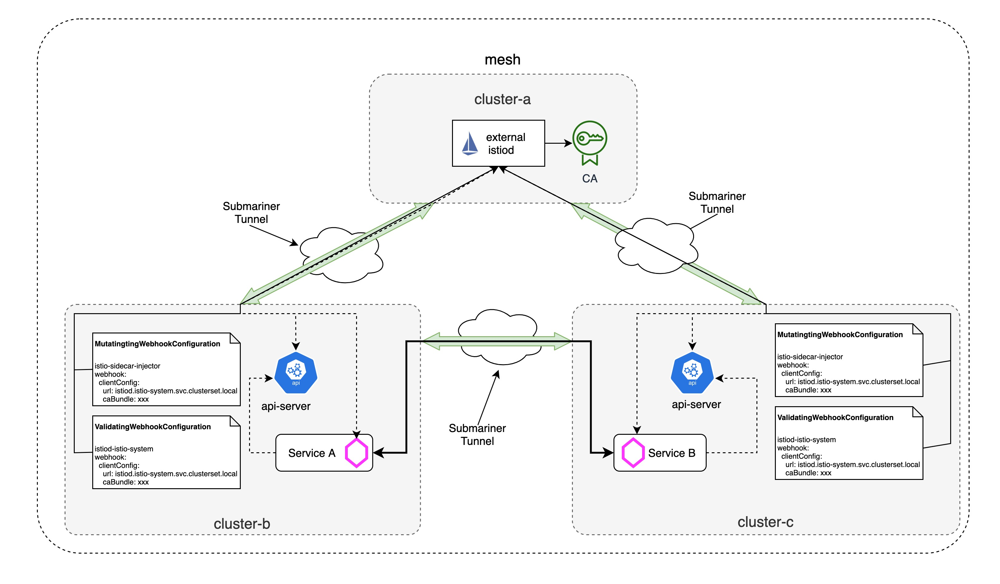

# Set up External Istiod with Submariner

## TL;DR

If you have't read the [last blog](./setup-istio-multicluster-with-submariner.md) about how to set up istio multicluster with submariner, please go through it before starting. In this blog, we will see how to set up external istiod in one central cluster and share it to the other microservices deployed among othere clusters.



## Prerequisites

Before we begin external istiod installation, we need to prepare three openshift clusters and deploy submariner for interconnection between the three clusters by following the [steps](https://submariner.io/getting-started/quickstart/openshift/aws/). To make it cleaner, we will create the following three clusters `cluster-a`, `cluster-b` and `cluster-c` with different IP CIDR ranges:

| Cluster | Pod CIDR | Service CIDR |
| --- | --- | --- |
| cluster-a | 10.128.0.0/14 | 172.30.0.0/16 |
| cluster-b | 10.132.0.0/14 | 172.31.0.0/16 |
| cluster-b | 10.136.0.0/14 | 172.32.0.0/16 |

For submariner installation with Service Discovery, we use `cluster-a` as broker and then join `cluster-a`, `cluster-b` and `cluster-c` to the broker. After you deploy the submariner, be sure to verify it is working with `subctl`:

```
export KUBECONFIG=cluster-a/auth/kubeconfig:cluster-b/auth/kubeconfig:cluster-c/auth/kubeconfig
subctl verify --kubecontexts cluster-a,cluster-b,cluster-c --only service-discovery,connectivity --verbose
```

In addition, we also need to follow these [instructions](https://istio.io/latest/docs/setup/platform-setup/openshift/) to update security configurations for the two openshift clusters before deploying istio.

## Mesh Operator Steps

A mesh operator is responsible for installing and managing the external Istio control plane on the central cluster. This includes exporting the istiod service on the cebtral cluster, which allows the remote cluster to access the control plane, and installing the sidecar injector webhook configuration on the remote cluster so that it will use the external control plane.

```
cat <<EOF > remote-config-cluster.yaml
apiVersion: install.istio.io/v1alpha1
kind: IstioOperator
metadata:
  namespace: external-istiod
spec:
  profile: external
  components:
    base:
      enabled: true
  values:
    global:
      istioNamespace: external-istiod
    pilot:
      configMap: true
    istiodRemote:
      injectionURL: https://${EXTERNAL_ISTIOD_ADDR}:15017/inject/:ENV:cluster=${REMOTE_CLUSTER_NAME}:ENV:net=network1
    base:
      validationURL: https://${EXTERNAL_ISTIOD_ADDR}:15017/validate
EOF
```