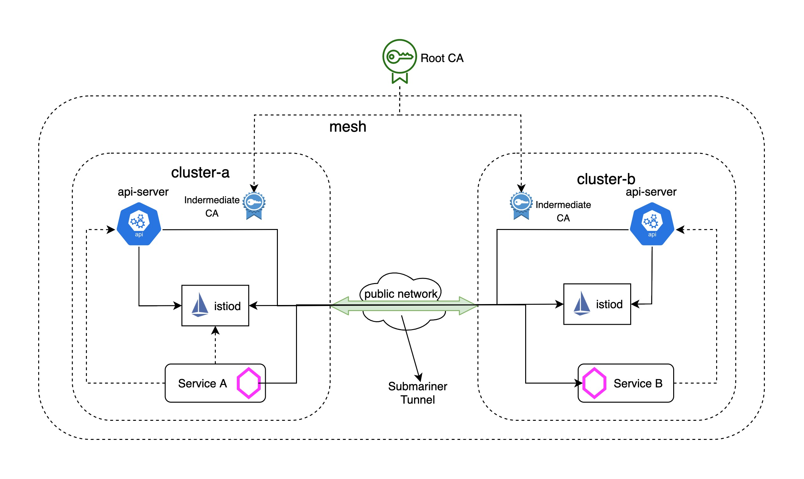

# Set up Istio Multicluster with Submariner

## Background

Istio provides [multiple options](https://istio.io/latest/docs/ops/deployment/deployment-models/) for how to deploy a single service mesh across multiple clusters, depending on the isolation, performance, and HA requirements. If you take another look at these different deployment models, you will find that either istio control plane(istiod) or kube-apiserver needs to be accessed from remote clusters, besides, these "global" microservices also need to be exposed to remote clusters. Although east-west gateway can be used to enable remote access, but it can become harder to understand and manage as the deployment of microservices grows in size and complexity.

## Submariner to the Rescue

[Submariner](https://submariner.io/) enables direct networking access between pods and services spinning in different Kubernetes clusters, either on-premises or in the cloud, it also provides [service discovery](https://submariner.io/getting-started/architecture/service-discovery/) across clusters and support for interconnecting clusters with [overlapping CIDRs](https://submariner.io/getting-started/architecture/globalnet/). With submariner, we don't need to manage the east-west gateways, all the pod and services can be accessed directly. This removes the burden on developers and mesh operators, which helps scale beyond a few clusters.

We will see how to set up istio [Primary-Remote on different networks](https://istio.io/latest/docs/setup/install/multicluster/primary-remote_multi-network/) model across two openshift clusters with submariner.

Note: Actually this blog also applies to istio [Primary-Remote](https://istio.io/latest/docs/setup/install/multicluster/primary-remote/) model, submariner will ensure there is direct connectivity between the pods and services in both clusters.

## Prerequisites

Before we begin a multicluster installation, we need to prepare two openshift clusters and deploy submariner for interconnection between the two clusters by following the [steps](https://submariner.io/getting-started/quickstart/openshift/aws/). To make it cleaner, we will create two clusters `cluster-a` and `cluster-b` with different IP CIDR ranges:

| Cluster | Pod CIDR | Service CIDR |
| --- | --- | --- |
| cluster-a | 10.128.0.0/14 | 172.30.0.0/16 |
| cluster-b | 10.132.0.0/14 | 172.31.0.0/16 |

For submariner installation with Service Discovery, we use `cluster-a` as broker and then join `cluster-a` and `cluster-b` to the broker. After you deploy the submariner, be sure to verify it is working with `subctl`:

```
export KUBECONFIG=cluster-a/auth/kubeconfig:cluster-b/auth/kubeconfig
subctl verify --kubecontexts cluster-a,cluster-b --only service-discovery,connectivity --verbose
```

In addition, we also need to follow these [instructions](https://istio.io/latest/docs/setup/platform-setup/openshift/) to update security configurations for the two openshift clusters before deploying istio.

## Configure Trust for Istio

A multicluster service mesh deployment requires that we establish trust between all clusters in the mesh, which means we need to use a common root certificate to generate intermediate certificates for each cluster. Follow the [instructions](https://istio.io/latest/docs/tasks/security/cert-management/plugin-ca-cert/) to generate and push a CA certificate secret to both the `cluster-a` and `cluster-b` clusters.

## Install Istio Primary-Remote Multicluster Model

We’re now ready to install an Istio mesh across multiple clusters. We start from the [Primary-Remote](https://istio.io/latest/docs/setup/install/multicluster/primary-remote_multi-network/) deployment model:



1. Set the default network for `cluster-a`:

If the istio-system namespace is already created, we need to set the cluster’s network there:

```
kubectl --kubeconfig=cluster-a/auth/kubeconfig get namespace istio-system && \
kubectl --kubeconfig=cluster-a/auth/kubeconfig label namespace istio-system topology.istio.io/network=network1
```

2. Configure `cluster-a` as a primary cluster:

Create the Istio configuration for `cluster-a`:

```
cat <<EOF > cluster-a.yaml
apiVersion: install.istio.io/v1alpha1
kind: IstioOperator
spec:
  components:
    cni:
      enabled: true
      namespace: kube-system
  values:
    global:
      meshID: mesh1
      multiCluster:
        clusterName: cluster-a
      network: network1
    cni:
      cniBinDir: /var/lib/cni/bin
      cniConfDir: /etc/cni/multus/net.d
      chained: false
      cniConfFileName: "istio-cni.conf"
      excludeNamespaces:
       - istio-system
       - kube-system
      logLevel: info
    sidecarInjectorWebhook:
      injectedAnnotations:
        k8s.v1.cni.cncf.io/networks: istio-cni
EOF
```

Then apply the configuration to `cluster-a`:

```
istioctl install --kubeconfig=cluster-a/auth/kubeconfig -f cluster-a.yaml --skip-confirmation
```

> Note: the `istio-cni` is enabled in the installation profile because the default CNI in openshift doesn't allow `istio-init` sidecar container to run, see [github issue](https://github.com/istio/istio/issues/23009) for more details.

3. Set the default network for `cluster-b`:

```
kubectl --kubeconfig=cluster-b/auth/kubeconfig get namespace istio-system && \
kubectl --kubeconfig=cluster-b/auth/kubeconfig label namespace istio-system topology.istio.io/network=network2
```

4. Enable API Server Access to `cluster-b`:

Before we can configure the remote cluster, we have to give the control plane in `cluster-a` access to the API Server in `cluster-b`, without API Server access, the control plane will reject the requests.

To provide API Server access to `cluster-b`, we will generate a remote secret and apply it to `cluster-a`b yhe following command:

```
istioctl x create-remote-secret --kubeconfig=cluster-b/auth/kubeconfig --name=cluster-b | kubectl apply -f - --kubeconfig=cluster-a/auth/kubeconfig
```

> Note: we are supoposed to get failure due to multiple secrets found in the serviceaccount `istio-system/istio-reader-service-account`, which will happen in openshift cluster. To workaround this, we need to get the correct secret name manually from that serviceaccount and specify the secret name by the `--secret-name` for `create-remote-secret` command:

```
ISTIO_READER_SRT_NAME=$(kubectl --kubeconfig=cluster-b/auth/kubeconfig -n istio-system get serviceaccount/istio-reader-service-account -o jsonpath='{.secrets}' | jq -r '.[] | select(.name | test ("istio-reader-service-account-token-")).name')
istioctl x create-remote-secret --kubeconfig=cluster-b/auth/kubeconfig --name=cluster-b --secret-name $ISTIO_READER_SRT_NAME | kubectl apply -f - --kubeconfig=cluster-a/auth/kubeconfig
```

5. Configure `cluster-b` as a remote cluster:

Save the address of Istiod service on the primary cluster:

```
export DISCOVERY_ADDRESS=$(kubectl --kubeconfig=cluster-a/auth/kubeconfig -n istio-system get svc istiod -o jsonpath='{.spec.clusterIP}')
```

Now create a remote configuration for `cluster-b`:

```
cat <<EOF > cluster-b.yaml
apiVersion: install.istio.io/v1alpha1
kind: IstioOperator
spec:
  components:
    cni:
      enabled: true
      namespace: kube-system
  values:
    global:
      meshID: mesh1
      multiCluster:
        clusterName: cluster-b
      network: network1
      remotePilotAddress: ${DISCOVERY_ADDRESS}
    cni:
      cniBinDir: /var/lib/cni/bin
      cniConfDir: /etc/cni/multus/net.d
      chained: false
      cniConfFileName: "istio-cni.conf"
      excludeNamespaces:
       - istio-system
       - kube-system
      logLevel: info
    sidecarInjectorWebhook:
      injectedAnnotations:
        k8s.v1.cni.cncf.io/networks: istio-cni
EOF
```

Then apply the configuration to `cluster-b`:

```
istioctl install --kubeconfig=cluster-b/auth/kubeconfig -f cluster-b.yaml --skip-confirmation
```

6. Verify the istio-ingressgateway in remote is connected to the istiod in primary:

```
# kubectl --kubeconfig=cluster-b/auth/kubeconfig -n istio-system get pod -l app=istio-ingressgateway
NAME                                    READY   STATUS    RESTARTS   AGE
istio-ingressgateway-7fd9cd6d7c-4bv7n   1/1     Running   0          4m
# istioctl --kubeconfig=cluster-a/auth/kubeconfig proxy-status
NAME                                                   CDS        LDS        EDS        RDS          ISTIOD                      VERSION
istio-ingressgateway-7bb5d9db56-5mrbx.istio-system     SYNCED     SYNCED     SYNCED     NOT SENT     istiod-5558899d65-cpm64     1.10.0
istio-ingressgateway-7fd9cd6d7c-4bv7n.istio-system     SYNCED     SYNCED     SYNCED     NOT SENT     istiod-5558899d65-cpm64     1.10.0
```

7. Verify the installation

Following the [guide](https://istio.io/latest/docs/setup/install/multicluster/verify/) to verify that our multicluster Istio installation is working properly.

Make sure the application pods in verify document are connected to the istiod in primary cluster:

```
# istioctl --kubeconfig=cluster-a/auth/kubeconfig proxy-status
NAME                                                   CDS        LDS        EDS        RDS          ISTIOD                      VERSION
helloworld-v1-776f57d5f6-268qd.sample                  SYNCED     SYNCED     SYNCED     SYNCED       istiod-5558899d65-cpm64     1.10.0
helloworld-v2-54df5f84b-vzqb9.sample                   SYNCED     SYNCED     SYNCED     SYNCED       istiod-5558899d65-cpm64     1.10.0
istio-ingressgateway-7bb5d9db56-5mrbx.istio-system     SYNCED     SYNCED     SYNCED     NOT SENT     istiod-5558899d65-cpm64     1.10.0
istio-ingressgateway-7fd9cd6d7c-4bv7n.istio-system     SYNCED     SYNCED     SYNCED     NOT SENT     istiod-5558899d65-cpm64     1.10.0
sleep-557747455f-kbqhw.sample                          SYNCED     SYNCED     SYNCED     SYNCED       istiod-5558899d65-cpm64     1.10.0
sleep-557747455f-x5ttc.sample                          SYNCED     SYNCED     SYNCED     SYNCED       istiod-5558899d65-cpm64     1.10.0
```

Verify that cross-cluster load balancing works as expected by calling the `HelloWorld` service several times using the `Sleep` pod:

```
# kubectl exec --kubeconfig=cluster-a/auth/kubeconfig -n sample -c sleep "$(kubectl get pod --kubeconfig=cluster-a/auth/kubeconfig -n sample -l app=sleep -o jsonpath='{.items[0].metadata.name}')" -- curl -sS helloworld.sample:5000/hello
Hello version: v2, instance: helloworld-v2-54df5f84b-vzqb9
# kubectl exec --kubeconfig=cluster-a/auth/kubeconfig -n sample -c sleep "$(kubectl get pod --kubeconfig=cluster-a/auth/kubeconfig -n sample -l app=sleep -o jsonpath='{.items[0].metadata.name}')" -- curl -sS helloworld.sample:5000/hello
Hello version: v1, instance: helloworld-v1-776f57d5f6-268qd
```

Verify the request routing is working as expected by creating the follow destionrules and virtualservices:

```
cat << EOF | kubectl --kubeconfig=cluster-a/auth/kubeconfig -n sample apply -f -
apiVersion: networking.istio.io/v1alpha3
kind: DestinationRule
metadata:
  name: helloworld
spec:
  host: helloworld
  subsets:
  - name: v1
    labels:
      version: v1
  - name: v2
    labels:
      version: v2
---
apiVersion: networking.istio.io/v1alpha3
kind: VirtualService
metadata:
  name: helloworld
spec:
  hosts:
  - helloworld
  http:
  - route:
    - destination:
        host: helloworld
        subset: v2
EOF
```

Then call the `HelloWorld` service several times using the `Sleep` pod:

```
# kubectl exec --kubeconfig=cluster-a/auth/kubeconfig -n sample -c sleep "$(kubectl get pod --kubeconfig=cluster-a/auth/kubeconfig -n sample -l app=sleep -o jsonpath='{.items[0].metadata.name}')" -- curl -sS helloworld.sample:5000/hello
Hello version: v2, instance: helloworld-v2-54df5f84b-vzqb9
# kubectl exec --kubeconfig=cluster-a/auth/kubeconfig -n sample -c sleep "$(kubectl get pod --kubeconfig=cluster-a/auth/kubeconfig -n sample -l app=sleep -o jsonpath='{.items[0].metadata.name}')" -- curl -sS helloworld.sample:5000/hello
Hello version: v2, instance: helloworld-v2-54df5f84b-vzqb9
# kubectl exec --kubeconfig=cluster-a/auth/kubeconfig -n sample -c sleep "$(kubectl get pod --kubeconfig=cluster-a/auth/kubeconfig -n sample -l app=sleep -o jsonpath='{.items[0].metadata.name}')" -- curl -sS helloworld.sample:5000/hello
Hello version: v2, instance: helloworld-v2-54df5f84b-vzqb9
```

## Summary

With submainer, it becomes easy to set up istio service mesh across multiple clusters, we don't need to care about how the traffic between the clusters is actually connected under the hood. After the control planes are set up, all services across clusters can be treated as in a single cluster, the east-west gateways are not needed any more, which make developers and mesh operators focus on their services and mesh, instead of interconnection bwtween clusters.

