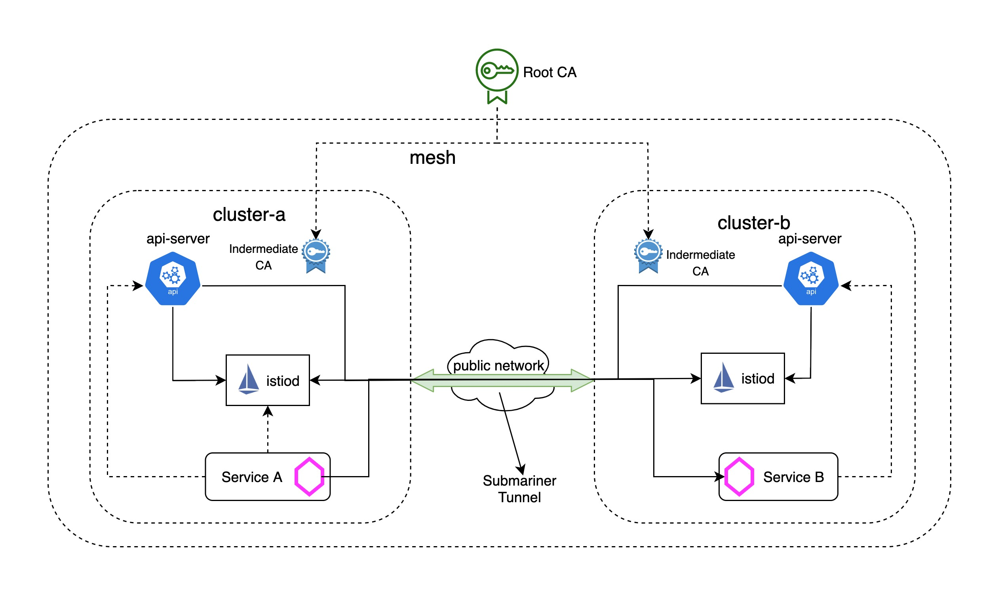

# Set up Istio Multicluster with Submariner in Red Hat Advanced Cluster Management for Kubernetes

## Background

Today, kubernetes has become the standard for container orchestration, and more organizations are increasingly deploying many more Kubernetes clusters, and treating these clusters as disposable, to facilitate features like geo-redundancy, scale, and isolation for their applications. As the most popular service mesh solution, Istio also provides [multiple options](https://istio.io/latest/docs/ops/deployment/deployment-models/) for how to deploy a single service mesh across multiple clusters, depending on the isolation, performance, and HA requirements. If you take another look at these different deployment models, you will find that either istio control plane(istiod) or kube-apiserver needs to be accessed from remote clusters. Besides, the microservices in the data plane that will need to be accessed across clusters also need to be exposed to remote clusters. Although an east-west gateway can be used to enable remote access, it can also increase the configuration difficulties as the deployment of microservices grows in size and complexity.

## Submariner to the Rescue

[Submariner](https://submariner.io/) enables direct networking access between pods and services sitting in different Kubernetes clusters, either on-premises and/or in the cloud. It implements this by facilitating a cross-cluster L3 connectivity using encrypted VPN tunnels, the [Gateway Engines](https://submariner.io/getting-started/architecture/gateway-engine/) are used to manage the secure tunnels to other clusters, while the [Broker](https://submariner.io/getting-started/architecture/broker/) is used to manage the exchange of metadata between Gateway Engines enabling them to discover one another. Submariner also provides [service discovery](https://submariner.io/getting-started/architecture/service-discovery/) across clusters and support for interconnecting clusters with [overlapping CIDRs](https://submariner.io/getting-started/architecture/globalnet/) by the [Globalnet Controller](https://submariner.io/getting-started/architecture/globalnet/).


In the context of service-mesh and multicluster, the use of submariner, would remove the need to  manage the east-west gateways, allowing for the selected pod and services to be accessed directly. This removes the burden on developers and mesh operators, which helps scale beyond a few clusters.

In this blog, we will see how rather than setup an istio in either a [Primary-Remote](https://istio.io/latest/docs/setup/install/multicluster/primary-remote/), [Multi-Primary-on-different-networks](https://istio.io/latest/docs/setup/install/multicluster/multi-primary_multi-network/) or [Primary-Remote-on-different-networks](https://istio.io/latest/docs/setup/install/multicluster/primary-remote_multi-network/) that all require multiple east-west gateways, submariner can be used to set up istio Multi-Primary model across many openshift clusters (two in this example) and verify that the istio multicluster installation is working properly.

## Prerequisites

Before we begin an istio multicluster installation, we need to prepare two openshift clusters and deploy submariner for interconnection between the two clusters by following those [steps](https://submariner.io/getting-started/quickstart/openshift/aws/). To make it simpler, we will create two clusters `cluster1` and `cluster2` with different IP CIDR ranges:

| Cluster | Pod CIDR | Service CIDR |
| --- | --- | --- |
| cluster1 | 10.128.0.0/14 | 172.30.0.0/16 |
| cluster2 | 10.132.0.0/14 | 172.31.0.0/16 |

For the submariner installation, we will use `cluster1` as the broker and then join `cluster1` and `cluster2` to the broker. Remember to verify that submariner is working properly by using the subctl command:

```
export KUBECONFIG=cluster1/auth/kubeconfig:cluster2/auth/kubeconfig
subctl verify --kubecontexts cluster1,cluster2 --only service-discovery,connectivity --verbose
```

In addition, we also need to follow these [instructions](https://istio.io/latest/docs/setup/platform-setup/openshift/) to update security configurations for the two openshift clusters before deploying istio.

## Configure Trust for Istio

A multicluster service mesh deployment requires that we establish trust between all clusters in the mesh, which means we need to use a common root certificate to generate intermediate certificates for each cluster. Follow these [instructions](https://istio.io/latest/docs/tasks/security/cert-management/plugin-ca-cert/) to generate and push a CA certificate secret to both the `cluster1` and `cluster2` clusters.

## Install Istio Multi-Primary Multicluster Model

We are now ready to install an istio mesh across multiple clusters. 

We will start with the istio [Multi-Primary](https://istio.io/latest/docs/setup/install/multicluster/multi-primary/) model, in which the istio control plane is installed on both `cluster1` and `cluster2`, making each of them a primary cluster.



Both clusters reside on the `network1` network, meaning there is direct connectivity between the pods in both clusters. The direct connectivity is achieved with submariner. In this configuration, each control plane observes the API Servers in both clusters for endpoints. Service workloads communicate directly (pod-to-pod) across cluster boundaries.

1. Configure `cluster1` as a primary cluster:

Create the following istio configuration for `cluster1`:

```
cat <<EOF > cluster1.yaml
apiVersion: install.istio.io/v1alpha1
kind: IstioOperator
spec:
  components:
    cni:
      enabled: true
      namespace: kube-system
  values:
    global:
      meshID: mesh1
      multiCluster:
        clusterName: cluster1
      network: network1
    cni:
      cniBinDir: /var/lib/cni/bin
      cniConfDir: /etc/cni/multus/net.d
      chained: false
      cniConfFileName: "istio-cni.conf"
      excludeNamespaces:
       - istio-system
       - kube-system
      logLevel: info
    sidecarInjectorWebhook:
      injectedAnnotations:
        k8s.v1.cni.cncf.io/networks: istio-cni
EOF
```

> Note: istio cni is enabled in the configuration to remove the `NET_ADMIN` and `NET_RAW` capabilities for users deploying pods into the Istio mesh on openshift clusters, check this [link](https://istio.io/latest/docs/setup/platform-setup/openshift/) for more details.

Then apply the configuration to `cluster1`:

```
istioctl install --kubeconfig=cluster1/auth/kubeconfig -f cluster1.yaml --skip-confirmation
```

2. Configure `cluster2` as another primary cluster:

Create the following istio configuration for `cluster2`:

```
cat <<EOF > cluster2.yaml
apiVersion: install.istio.io/v1alpha1
kind: IstioOperator
spec:
  components:
    cni:
      enabled: true
      namespace: kube-system
  values:
    global:
      meshID: mesh1
      multiCluster:
        clusterName: cluster2
      network: network1
    cni:
      cniBinDir: /var/lib/cni/bin
      cniConfDir: /etc/cni/multus/net.d
      chained: false
      cniConfFileName: "istio-cni.conf"
      excludeNamespaces:
       - istio-system
       - kube-system
      logLevel: info
    sidecarInjectorWebhook:
      injectedAnnotations:
        k8s.v1.cni.cncf.io/networks: istio-cni
EOF
```

Then apply the configuration to `cluster2`:

```
istioctl install --kubeconfig=cluster2/auth/kubeconfig -f cluster2.yaml --skip-confirmation
```

3. Enable endpoint discovery from each cluster for istio:

We need to make sure each API server can be accessed by the istio control plane on the other cluster so that all the endpoints can be discovered across clusters Without API Server access, the control plane will reject the requests to the endpoints on other clusters.

To provide API Server access to `cluster1`, we will generate a remote secret in `cluster2` and apply it to `cluster1` by running the following command:

```
istioctl x create-remote-secret --kubeconfig=cluster2/auth/kubeconfig --name=cluster2 | kubectl apply -f - --kubeconfig=cluster1/auth/kubeconfig
```

> Note: we are supposed to get an error due to multiple secrets found in the serviceaccount `istio-system/istio-reader-service-account` in openshift cluster. To workaround this, we simply need to get the correct secret name manually from that serviceaccount and specify the secret name by the `--secret-name` for `create-remote-secret` command:


```
ISTIO_READER_SRT_NAME=$(kubectl --kubeconfig=cluster2/auth/kubeconfig -n istio-system get serviceaccount/istio-reader-service-account -o jsonpath='{.secrets}' | jq -r '.[] | select(.name | test ("istio-reader-service-account-token-")).name')
istioctl x create-remote-secret --kubeconfig=cluster2/auth/kubeconfig --name=cluster2 --secret-name $ISTIO_READER_SRT_NAME | kubectl apply -f - --kubeconfig=cluster1/auth/kubeconfig
```

Similarly, we will also generate a remote secret in `cluster1` and apply it to `cluster2` by running the following command:

```
istioctl x create-remote-secret --kubeconfig=cluster1/auth/kubeconfig --name=cluster1 | kubectl apply -f - --kubeconfig=cluster2/auth/kubeconfig || true
ISTIO_READER_SRT_NAME=$(kubectl --kubeconfig=cluster1/auth/kubeconfig -n istio-system get serviceaccount/istio-reader-service-account -o jsonpath='{.secrets}' | jq -r '.[] | select(.name | test ("istio-reader-service-account-token-")).name')
istioctl x create-remote-secret --kubeconfig=cluster1/auth/kubeconfig --name=cluster1 --secret-name $ISTIO_READER_SRT_NAME | kubectl apply -f - --kubeconfig=cluster2/auth/kubeconfig
```

4. Verify the `istio-ingressgateway` pods in each cluster are connected to the istiod of its own cluster:

```
$ kubectl --kubeconfig=cluster1/auth/kubeconfig -n istio-system get pod -l app=istio-ingressgateway
NAME                                    READY   STATUS    RESTARTS   AGE
istio-ingressgateway-5698ff4d77-wwz8c   1/1     Running   0          1m42s
$ kubectl --kubeconfig=cluster2/auth/kubeconfig -n istio-system get pod -l app=istio-ingressgateway
NAME                                    READY   STATUS    RESTARTS   AGE
istio-ingressgateway-565bd54476-jb84z   1/1     Running   0          1m39s
$ istioctl --kubeconfig=cluster1/auth/kubeconfig proxy-status
NAME                                                   CDS        LDS        EDS        RDS          ISTIOD                     VERSION
istio-ingressgateway-5698ff4d77-wwz8c.istio-system     SYNCED     SYNCED     SYNCED     NOT SENT     istiod-c6965799f-cjct2     1.10.0
$ istioctl --kubeconfig=cluster2/auth/kubeconfig proxy-status
NAME                                                   CDS        LDS        EDS        RDS          ISTIOD                      VERSION
istio-ingressgateway-565bd54476-jb84z.istio-system     SYNCED     SYNCED     SYNCED     NOT SENT     istiod-6765d8c666-mlcrc     1.10.0
```

5. Verify the installation:

Follow this [guide](https://istio.io/latest/docs/setup/install/multicluster/verify/) to verify that the istio multicluster installation is working properly.

Make sure the application pods are connected to the istiod in their own primary cluster:

```
$ istioctl --kubeconfig=cluster1/auth/kubeconfig proxy-status
NAME                                                   CDS        LDS        EDS        RDS          ISTIOD                     VERSION
helloworld-v1-776f57d5f6-mwq9j.sample                  SYNCED     SYNCED     SYNCED     SYNCED       istiod-c6965799f-cjct2     1.10.0
istio-ingressgateway-5698ff4d77-wwz8c.istio-system     SYNCED     SYNCED     SYNCED     NOT SENT     istiod-c6965799f-cjct2     1.10.0
sleep-557747455f-jh2p2.sample                          SYNCED     SYNCED     SYNCED     SYNCED       istiod-c6965799f-cjct2     1.10.0
$ istioctl --kubeconfig=cluster2/auth/kubeconfig proxy-status
NAME                                                   CDS        LDS        EDS        RDS          ISTIOD                      VERSION
helloworld-v2-54df5f84b-7prhg.sample                   SYNCED     SYNCED     SYNCED     SYNCED       istiod-6765d8c666-mlcrc     1.10.0
istio-ingressgateway-565bd54476-jb84z.istio-system     SYNCED     SYNCED     SYNCED     NOT SENT     istiod-6765d8c666-mlcrc     1.10.0
sleep-557747455f-q5n8g.sample                          SYNCED     SYNCED     SYNCED     SYNCED       istiod-6765d8c666-mlcrc     1.10.0
```

6. Verify that cross-cluster load balancing works as expected by calling the `HelloWorld` service several times from the `Sleep` pod:

```
$ kubectl exec --kubeconfig=cluster1/auth/kubeconfig -n sample -c sleep "$(kubectl get pod --kubeconfig=cluster1/auth/kubeconfig -n sample -l app=sleep -o jsonpath='{.items[0].metadata.name}')" -- curl -sS helloworld.sample:5000/hello
Hello version: v1, instance: helloworld-v1-776f57d5f6-mwq9j
$ kubectl exec --kubeconfig=cluster1/auth/kubeconfig -n sample -c sleep "$(kubectl get pod --kubeconfig=cluster1/auth/kubeconfig -n sample -l app=sleep -o jsonpath='{.items[0].metadata.name}')" -- curl -sS helloworld.sample:5000/hello
Hello version: v2, instance: helloworld-v2-54df5f84b-7prhg
```

7. Verify the request routing is working as expected by creating the follow `destionrules` and `virtualservices`:

```
cat << EOF | kubectl --kubeconfig=cluster1/auth/kubeconfig -n sample apply -f -
apiVersion: networking.istio.io/v1alpha3
kind: DestinationRule
metadata:
  name: helloworld
spec:
  host: helloworld
  subsets:
  - name: v1
    labels:
      version: v1
  - name: v2
    labels:
      version: v2
---
apiVersion: networking.istio.io/v1alpha3
kind: VirtualService
metadata:
  name: helloworld
spec:
  hosts:
  - helloworld
  http:
  - route:
    - destination:
        host: helloworld
        subset: v2
EOF
```

Then call the `HelloWorld` service several times using the `Sleep` pod:

```
$ kubectl exec --kubeconfig=cluster1/auth/kubeconfig -n sample -c sleep "$(kubectl get pod --kubeconfig=cluster1/auth/kubeconfig -n sample -l app=sleep -o jsonpath='{.items[0].metadata.name}')" -- curl -sS helloworld.sample:5000/hello
Hello version: v2, instance: helloworld-v2-54df5f84b-7prhg
$ kubectl exec --kubeconfig=cluster1/auth/kubeconfig -n sample -c sleep "$(kubectl get pod --kubeconfig=cluster1/auth/kubeconfig -n sample -l app=sleep -o jsonpath='{.items[0].metadata.name}')" -- curl -sS helloworld.sample:5000/hello
Hello version: v2, instance: helloworld-v2-54df5f84b-7prhg
$ kubectl exec --kubeconfig=cluster1/auth/kubeconfig -n sample -c sleep "$(kubectl get pod --kubeconfig=cluster1/auth/kubeconfig -n sample -l app=sleep -o jsonpath='{.items[0].metadata.name}')" -- curl -sS helloworld.sample:5000/hello
Hello version: v2, instance: helloworld-v2-54df5f84b-7prhg
```

## Summary

Submariner, simplifies the  setup of istio service mesh across multiple clusters by bringing everything under a simple single model..
