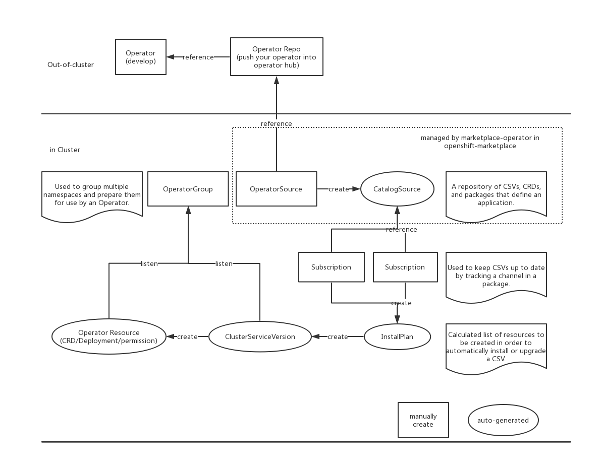

## Overview

Operator is a method of packaging, deploying and managing a kubernetes application. In other words Day-1(install) + Day-2 (management/upgrade/uninstall...) operatoions. In comparison to Helm, Helm was focussed on Day 1. Helm provided a well defined packaging of Kubernetes application, whereas operators bring in both Day-1 and Day-2 operations together. Operators are most suited for complex and stateful applications requiring application domain knowledge to correctly scale, upgrade, and reconfigure while protecting against data loss or unavailability.

## Operator SDK

### What is Operator SDK?

Operator SDK is component of the [Operator Framework](https://github.com/operator-framework), an open source toolkit to manage Kubernetes native applications, called Operators, in an effective, automated, and scalable way. The Operator SDK makes it easier to build Kubernetes native applications, a process that can require deep, application-specific operational knowledge.

### What can I do with Operator SDK?

The Operator SDK provides the tools to build, test, and package Operators. Initially, the SDK facilitates the marriage of an application’s business logic (for example, how to scale, upgrade, or backup) with the Kubernetes API to execute those operations. Over time, the SDK can allow engineers to make applications smarter and have the user experience of cloud services. Leading practices and code patterns that are shared across Operators are included in the SDK to help prevent reinventing the wheel.

The Operator SDK is a framework that uses the [controller-runtime](https://github.com/kubernetes-sigs/controller-runtime) library to make writing operators easier by providing:

1. High level APIs and abstractions to write the operational logic more intuitively
2. Tools for scaffolding and code generation to bootstrap a new project fast
3. Extensions to cover common Operator use cases


### Build an operator with Operator SDK?

#### Helm Operator

Here are some details for how to build a helm operator https://sdk.operatorframework.io/docs/building-operators/helm/quickstart/

We can use one command to create a helm operator as follows:

```
operator-sdk new nginx-operator --api-version=example.com/v1alpha1 --kind=Nginx --type=helm
```

The problem for helm operator is that developers can not customize the logic of the operator, it still using `helm/tiller` to manage charts.

#### Go Operator

Use Operator SDK to build your own operator, the major logic is building your own API(CRD) and your own `reconcile` method.

Developers can put their own logic in the go operator. Here are some details for how to use Go operator https://sdk.operatorframework.io/docs/building-operators/golang/quickstart/

**Note:** Prefer Go Operator because we have more control what the operator do and the order doing things.

#### Best Practise

- How to handle the case if your operator need to manage multiple resources?

  - Please refer to https://github.com/operator-framework/operator-sdk/issues/2300 for more detail.

  - Assume I have an application a1 which include c1, c2 and c3 as internal components, and now I want to create a operator to manage a1. Currently there here are two options for the operator of a1:

  - **Option 1**: Use one operator to manage c1, c2 and c3 for application a1.

  - **Option 2**: Build operators for c1, c2 and c3, then use build operator for application a1 with operators for c1, c2 and c3.

  - The best practise for this is it depends on the complexity of c1, c2, and c3. If they are simple components that are tightly coupled, then a single operator can handle all three.

  - However if one or more of them have complex reconciliation requirements (e.g. a database that requires backups and data migrations between versions) or they can be managed as standalone components (i.e. they have loose coupling), then separate operators for c1, c2, and c3 might make more sense. Then the a1 operator would only need to be concerned with the high-level abstractions exposed by the CRDs of c1, c2, and c3 operators.

- Each operator belong to different namespaces.
- Each operator should use [OLM(Operator Lifecycle Manager)](https://github.com/operator-framework/operator-lifecycle-manager) to manage its lifecycle.

### OLM(Operator Lifecycle Manager)

The Operator Lifecycle Manager (OLM) helps users install, update, and manage the lifecycle of all Operators and their associated services running across their clusters. It is part of the Operator Framework, an open source toolkit designed to manage Kubernetes native applications (Operators) in an effective, automated, and scalable way.



From above diagram, we can see that we need provide the operator and operator repo out of cluster. once we prepare them, we can use the operator in cluster. Firstly, we need to create a `OperatorSource` which is used to point to the operator repo. Secondly, we need to create `Subscription` to be used to keep your CSV up to date. Thirdly, create `OperatorGroup` to be used to by CSV and operator. Finally, you can create a CR to consume your CRD.

## References

- https://coreos.com/blog/introducing-operator-framework
- https://sdk.operatorframework.io
- https://github.com/operator-framework/getting-started#getting-started
- https://github.com/operator-framework/operator-lifecycle-manager
- https://github.com/operator-framework/operator-registry

## FAQ

- If my operator is helm based operator, can I upgrade it from Helm release to helm operator directly?

  - Yes, you can upgrade, but rollback will not work. So the best practise for helm to operator upgrade and rollback is uninstall and install.

- If I change my operator from Helm based operator to Go based operator, can I upgrade directly?

  - Yes, you can do the upgrade logic in your Go operator, but rollback can't be accomplished.

- Does each operator need to be in difference namespace?

  - Yes, the best practise is we should put all opreators into a single namespace just follow the OCP style.

- How to create a operator if the operator including multiple operators.

  - Please refer to https://github.com/operator-framework/operator-sdk/issues/2300 for more detail.

  - Assume I have an application a1 which include c1, c2 and c3 as internal components, and now I want to create a operator to manage a1. Currently there here are two options for the operator of a1:

  - **Option 1**: Use one operator to manage c1, c2 and c3 for application a1.

  - **Option 2**: Build operators for c1, c2 and c3, then use build operator for application a1 with operators for c1, c2 and c3.

  - The best practise for this is it depends on the complexity of c1, c2, and c3. If they are simple components that are tightly coupled, then a single operator can handle all three.

  - However if one or more of them have complex reconciliation requirements (e.g. a database that requires backups and data migrations between versions) or they can be managed as standalone components (i.e. they have loose coupling), then separate operators for c1, c2, and c3 might make more sense. Then the a1 operator would only need to be concerned with the high-level abstractions exposed by the CRDs of c1, c2, and c3 operators. Like the prometheus (Under going)


- How to decide if my operator will use Go or helm based operator?

  - If your operator has CRD, then we should use Go based operator. As helm operator can not handle the install sequence of CRD and CR, and cannot handle hook well.
  - If your operator has no CRD, you can go ahead with Helm based operator.
  
- Can I use daemonset for my operator?

  - If you create daemonset, it will be running on all OCP nodes, so it is better to use deployment instead to make sure not run so many instance for your operator.
  - If you have the intention to run your service in each node, just use `daemonset`, like metering etc
